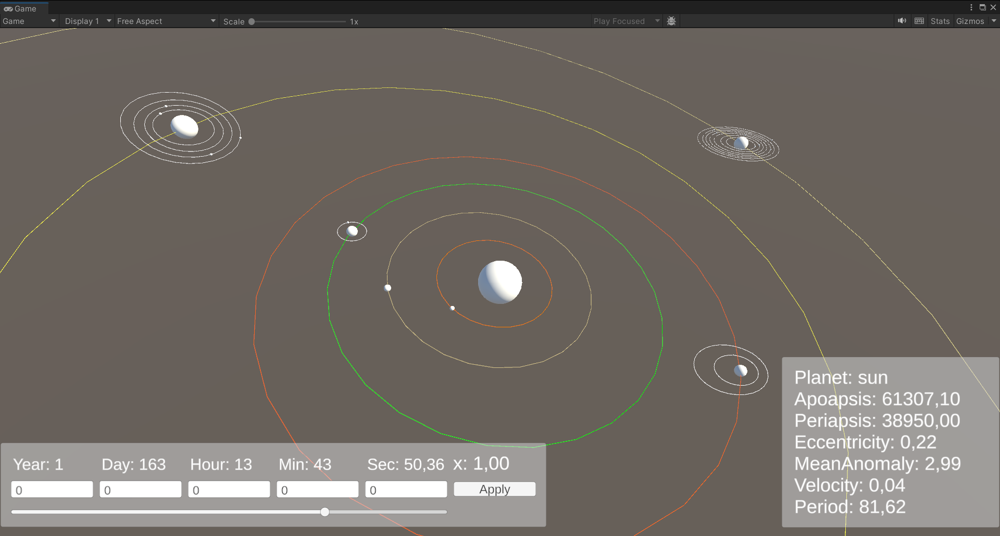
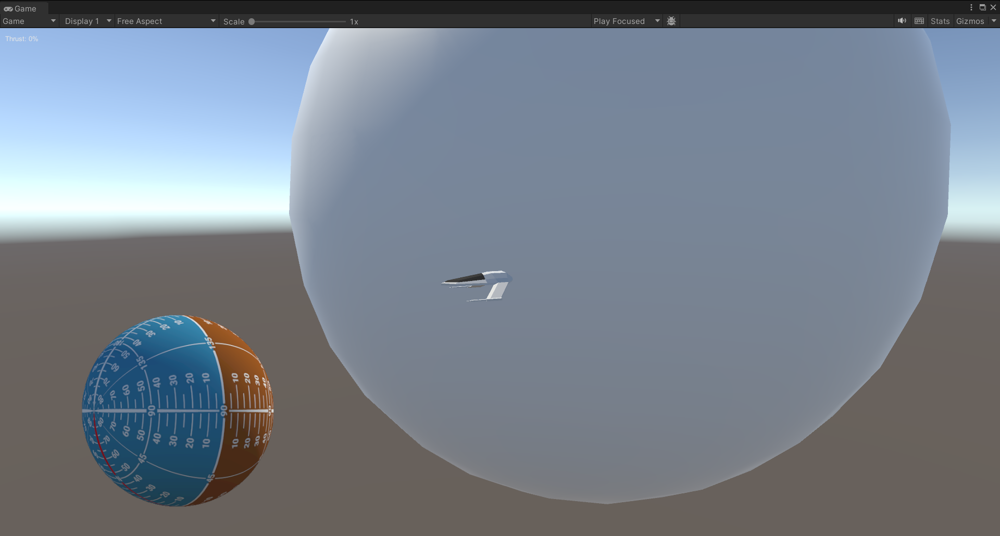
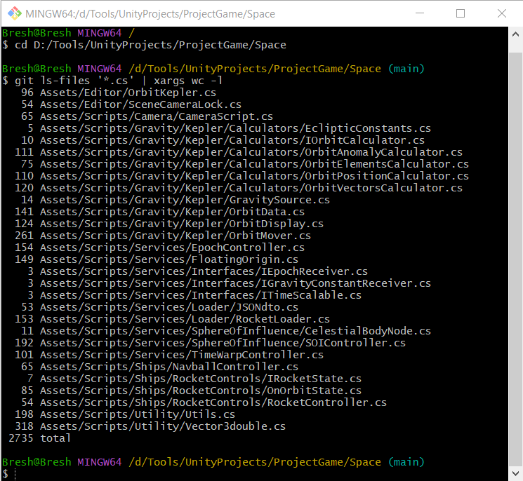

# 🚀 Space! (Based on Kepler's orbit equations)

## 🎮 Game Concept

A small-scale space simulation game inspired by *Kerbal Space Program*.  
The player can design rockets, launch them into orbit, and explore space using realistic (but simplified in distances) orbital mechanics.
The game features a progression system based on science and economy.  
  
## 📈 Player Progression
Players earn **science points** by conducting experiments, exploring new celestial bodies, and reaching key milestones (e.g., first orbit, landing, interplanetary transfer). These points can be used to unlock new technologies through a **science tree**, gradually expanding the player's ability to build more advanced rockets and modules.
  
Each rocket part has a **cost**, and missions must be planned within budget constraints, encouraging efficient design and thoughtful execution.  
  
This system aims to simulate the challenges of real-world space programs - balancing scientific advancement, engineering capabilities, and limited funding.

### ⚙️ How it Works

- **Celestial Bodies** are moved based on precomputed orbital parameters using custom classes like `OrbitData` and `OrbitMover`. These data-driven orbits are visualized in the editor through `OrbitDisplay`, including sphere of influence (SOI) boundaries.
- A **SOI System** tracks which body currently dominates a vessel’s gravity. The central body becomes static, simplifying motion calculations, while others orbit around it — making transitions between bodies intuitive and less error-prone.
- A **Floating Origin** system keeps the active vessel near world center to preserve floating-point precision during interplanetary travel.
- **Double Precision Vectors** (`Vector3double`) are used for accurate positioning at astronomical scales.
- **Thrust and Control Mechanics** allow precise spacecraft maneuvers with WASDQE and adjustable throttle.
- **Time Manipulation** through `TimeWarpController` lets the player fast-forward or slow down time.
- A custom **Navball UI** mirrors real-world navigation aids, clearly displaying spacecraft orientation.
- The entire system is modular, with orbit calculations abstracted into separate classes and delegated through `OrbitData` for maintainability.

---

## ✅ Implemented Features

- 🌌 3D hybrid space environment
- 🪐 Orbital mechanics using Keplerian calculations
- 🌍 Planetary gravity and dynamic sphere of influence system
- 🚀 Thrust and rotation controls (WASDQE + throttle)
- 🧭 Navigation UI with navball
- 🧷 Floating Origin support (precision at scale)
- 🎥 Custom camera controls (focus, zoom, object tracking)
- 💾 Save/load game state with orbit persistence
- 🔧 Tools for solar system creation
- ⏩ Adjustable time warp
- 🕰 Epoch-based astronomical timing system
## 🔜 Planned Features


### 🧩 Gameplay Systems

- Rocket construction system (modular assembly)
- Mission objectives and progression
- Science point system with unlockable tech tree
- Budget management and part costs

### ⚙️ Physics & Mechanics

- Atmospheric drag and reentry heat simulation
- Aerodynamics system for designing functional aircraft and spaceplanes (lift, drag, control surfaces)
- Surface landing mechanics
- Orbital maneuvering tool

### 🌍 Simulation & World

- Solar system map mode with multiple SOIs (Sphere of Influence)
- Time warp system for orbital maneuvering and long-distance travel

### 🛠 Procedural Generation

- Procedural planet generation (size, terrain, gravity)
- Procedural solar system generation (planet count, layout, orbit)

## 🧱 Technologies & Tools

- Unity (version 2022.3.3)
- C#

## 🧪 How to Play / Test

1. Clone the repository  
2. Open in Unity Hub  
3. Load any available scene  
4. Press Play and explore space!  

## 📸 Screenshots
Solar System example

Navigational ball showcase

Project size



## 💡 Development Philosophy

### 🧱 Programming Principles

- **Single Responsibility Principle (SRP)**  
  Each class in the project has one clear purpose. For example, `OrbitData` only stores orbital parameters, while calculation logic is delegated to specialized classes like `OrbitKeplerianCalculator`.

- **Open/Closed Principle (OCP)**  
  Orbit calculation logic is abstracted, so new calculation models (e.g. patched conics or n-body) can be added without modifying `OrbitData`. You just plug in a new calculator.

- **DRY (Don't Repeat Yourself)**  
  Reusable components like `Vector3double` and centralized orbit systems reduce code duplication, especially in gravity calculations and floating origin adjustments.

- **KISS (Keep It Simple, Stupid)**  
  Instead of full physics simulation for every body, the system simplifies orbital motion through Keplerian approximation unless detailed physics is absolutely required (like for the player rocket).

- **YAGNI (You Ain’t Gonna Need It)**  
  The architecture avoids bloated systems like full n-body physics or complex resource pipelines until truly needed. Everything is driven by immediate gameplay or educational goals.

- **Interface Segregation Principle (ISP)**  
  Orbit-related classes expose only the necessary parts. For instance, `IOrbitCalculator` defines only what's needed to compute positions, keeping unrelated logic out.

- **Separation of Concerns (SoC)**  
  Different responsibilities are clearly split: `OrbitData` handles data, calculators do math, `OrbitDisplay` handles visualization, and `SOIController` handles reference frame changes. This makes the system easier to reason about and extend.

---
### 🧰 Design Patterns
#### 1️⃣ Singleton
The Singleton pattern ensures a class has only one instance and provides a global point of access to it. This is especially useful in Unity for systems that need to be universally accessible but exist only once in the scene.

In this project, several systems are implemented as singletons:
- `SOIController`
- `TimeWarpController`
- `RocketLoader`
- `EpochController`
- `FloatingOrigin`

These systems represent global managers or services that shouldn't have multiple instances and must be easily accessed from anywhere in the game. Here’s an example using `EpochController`:
```c#
public class EpochController : MonoBehaviour, ITimeScalable
{
    // Static instance to allow global access
    public static EpochController Instance { get; private set; }
    
    private void Awake()
    {
        // If an instance already exists, destroy this one to enforce the Singleton pattern
        if (Instance != null)
        {
            Destroy(gameObject);
            return;
        }

        Instance = this;
    }
}
```

---
#### ☎ Mediator
The Mediator pattern is used to coordinate communication between independent components. In this project, systems like `TimeWarpManager` and `EpochController` act as mediators for time-based updates.

Here's an example of `TimeWarpManager` implementing the Mediator pattern:
```c#
public interface ITimeScalable
{
    void OnTimeScaleChanged(float newScale);
}

public class TimeWarpManager : MonoBehaviour
{
    public static TimeWarpManager Instance { get; private set; }
    private readonly List<ITimeScalable> timeScaleListeners = new();
    [SerializeField] private float timeScale = 1f;

    private void Awake()
    {
        if (Instance != null)
        {
            Destroy(gameObject);
            return;
        }
        Instance = this;
    }

    private void OnValidate()
    {
        if (Instance == this)
        {
            SetTimeScale(timeScale);
        }
    }

    public void SetTimeScale(float scale)
    {
        timeScale = scale;
        foreach (var listener in timeScaleListeners)
            listener.OnTimeScaleChanged(timeScale);
    }

    public void Register(ITimeScalable scalable)
    {
        if (!timeScaleListeners.Contains(scalable))
            timeScaleListeners.Add(scalable);
    }
}
```
This approach decouples time-dependent systems from each other, improving maintainability and flexibility.

---
#### 🎛 State
The State pattern is used to manage object behavior based on its internal state. In this project, `RocketController` uses it to control how the rocket responds during different phases such as `OnOrbit`, `OnSurface`, `TimeWarping`.

Each state implements a shared interface and overrides its behavior accordingly.

Example interface and usage:
```c#
public interface IRocketState
{
    void Enter(RocketController rocket);
    void Exit(RocketController rocket);
    void Update();
    void FixedUpdate();
    void OnGUI();
}

public class RocketController : MonoBehaviour
{
    private IRocketState currentState;

    public void SetState(IRocketState newState)
    {
        currentState?.Exit(this);
        currentState = newState;
        currentState?.Enter(this);
    }

    private void Update()
    {
        currentState?.Update();
    }

    private void FixedUpdate()
    {
        currentState?.FixedUpdate();
    }

    private void OnGUI()
    {
        currentState?.OnGUI();
    }
}
```
This pattern makes it easier to extend rocket behaviors without bloating a single `RocketController` class.

---
#### 🎭 Facade + 🧠 Strategy
`OrbitData` class demonstrates a combination of **Facade** and **Strategy** design patterns.

- **Facade:** `OrbitData` provides simple methods like `CalculateOrbitStateFromOrbitalVectors()` or `CalculateOrbitStateFromOrbitalElements()`, which hide complex mathematical logic from the rest of the system.
- **Strategy:** The system can use different calculation strategies (`OrbitVectorsCalculator` or `OrbitElementsCalculator`) depending on whether the orbit should be calculated from vectors or orbital elements.

Code example:
```c#
public interface IOrbitElementsCalculator
{
    void CalculateOrbitStateFromOrbitalElements(OrbitData target);
}

public partial class OrbitData
{
    // Simplified orbital properties (omitted here for brevity)

    private readonly OrbitVectorsCalculator _vectorCalc = new OrbitVectorsCalculator();
    private readonly OrbitElementsCalculator _elementsCalc = new OrbitElementsCalculator(); 

    public void CalculateOrbitStateFromOrbitalVectors()
    {
        _vectorCalc.CalculateOrbitStateFromOrbitalVectors(this);
    }

    public void CalculateOrbitStateFromOrbitalElements()
    {
        _elementsCalc.CalculateOrbitStateFromOrbitalElements(this);
    }
}
```
This design allows clean API usage (`orbitData.CalculateOrbit...()`), while still supporting different internal math implementations without modifying client code.

---
### ♻️ Refactoring Techniques
Throughout the development of the project, several refactoring techniques have been applied to maintain code clarity, reduce duplication, and improve maintainability.

#### 🔧 Extract Method
Long methods were broken down into smaller, more focused functions.

For example, orbit calculations that were previously embedded into large methods were split into reusable helpers. 

A concrete case is `CalculateOrbitStateFromOrbitalElements`, which originally contained all logic inline. Now, specific sections such as elliptic orbit handling are extracted into separate methods like `CalculateEllipticElements`, making the code clearer, easier to debug, and reusable for similar cases.

#### 🔢 Replace Magic Numbers with Constants
All mathematical constants, such as gravitational constant or PI-related factors, were moved into named variables to make formulas easier to understand and tweak.

#### 📦 Introduce Parameter Object
Instead of passing multiple loosely related parameters, objects like `OrbitData` were used to carry grouped data, simplifying method signatures and reducing argument clutter.

#### 🧩 Replace Conditional with Polymorphism
In the rocket's state logic, condition-heavy updates were replaced by using polymorphic `IRocketState` implementations, following the State pattern.

#### 🧱 Split Class
Large, overly complex classes were split into multiple smaller classes.

For example, `OrbitData` at the start was a mega-class that contained all orbital parameters and calculation logic.

Over time, the logic was extracted into separate calculators like `OrbitVectorsCalculator` and `OrbitElementsCalculator`, allowing `OrbitData` to focus solely on state.

#### 🏷️ Use Descriptive Naming
Method and class names were carefully chosen to describe their behavior clearly, which reduces the need for inline comments and makes code self-explanatory.

#### 🗑️ Remove Dead Code
Unused fields, outdated functions, and commented-out blocks were actively pruned to keep the codebase clean and prevent confusion.

#### 🔁 Consolidate Duplicate Conditional Fragments
Repeated logic inside if/else blocks was extracted to common methods, reducing duplication and error surface.

For example, eccentricity-based conditions like 
```c#
if (ecc > 1) 
{ 
    // big block of math
} 
else if (ecc < 1) 
{
    // big block of math
}
else
{
    // big block of math
}
```
used to contain large blocks of similar code for hyperbolic and elliptical cases. 

Now, these branches are handled separately in specialized calculator classes through dedicated methods, reducing clutter and improving modularity.

## 🤝 Contributions

Pull requests are welcome.    
If you're interested in collaborating, feel free to reach out or open an issue.

> ⚠️ **Code Style & Precision Guidelines**  
> - Be mindful when choosing between `float` and `double`. While Unity primarily uses `float`, certain orbital or long-distance calculations may require `double` for precision.  
> - Avoid unnecessary conversions between `float` and `double` to reduce performance cost and bugs.  
> - Precision errors can occur when dealing with very large coordinates (e.g., in interplanetary distances). Always test floating origin and orbital calculations carefully to prevent jittering or drift.
> - All units use The International System of Units (SI System)